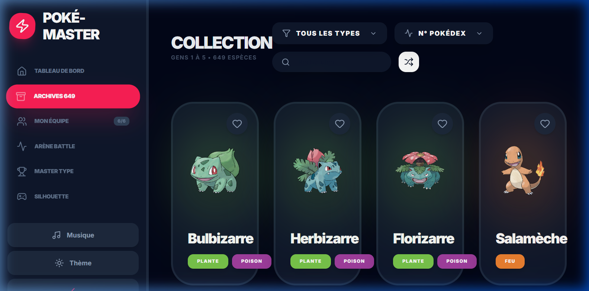
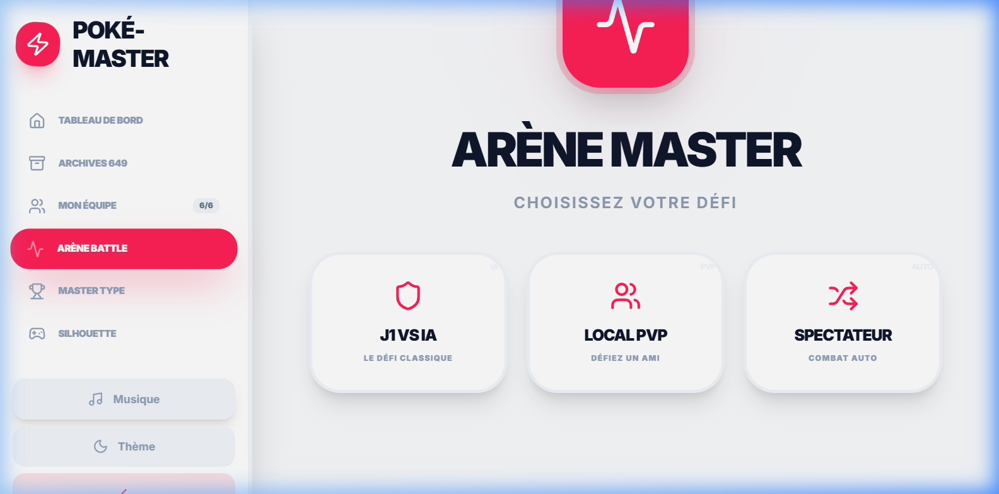
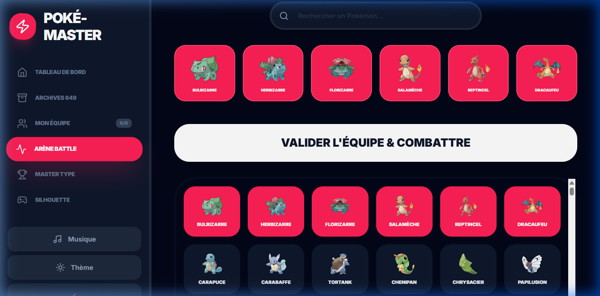
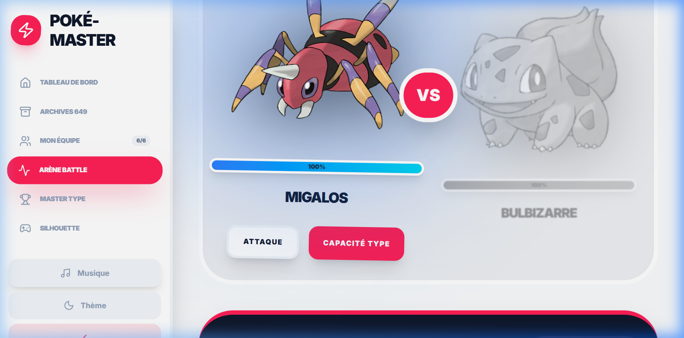
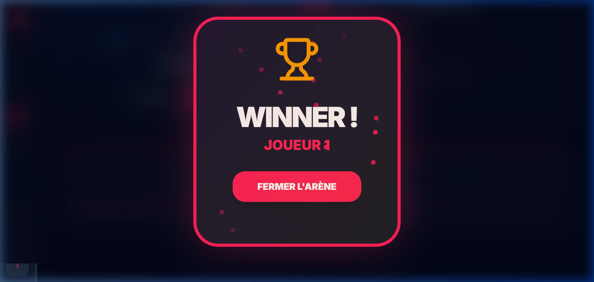

# ⚡ Pokém-Master - L'Arène Élite

Bienvenue dans l'expérience Pokédex ultime. Une plateforme premium conçue pour les dresseurs exigeants, alliant une gestion complète de collection (V1-V9) et une arène de combat tactique interactive.

---

## 🎨 Aperçu de l'Interface


### 📂 Collection & Tactique
Une base de données exhaustive couvrant **1025 Pokémon** des Générations 1 à 9. Filtrez par type, triez par statistiques et composez votre équipe de rêve avec des analyses en temps réel.



### ⚔️ Arène Master
Passez à l'action avec un système de combat manuel au tour par tour. 

*   **Mode J1 vs IA** : Testez vos limites contre l'ordinateur.
*   **Mode Local PvP** : Défiez vos amis sur la même machine.
*   **Mode Spectateur** : Admirez deux IA s'affronter.



### 🔍 Sélection & Combat
Une interface de sélection intelligente avec barre de recherche pour préparer vos duels rapidement.




### 🏆 Gloire & Célébration
Chaque victoire est récompensée par une animation premium célébrant vos exploits.



---

## 🚀 Fonctionnalités Clés

*   **Gestion d'Équipe (6/6)** : Choisissez vos champions parmi 1025 espèces.
*   **Système de Combat Manuel** : Choisissez entre attaques classiques et capacités spéciales liées au Type.
*   **Design Premium** : Glassmorphism, animations fluides, thèmes clair et sombre automatiques.
*   **Utilitaires Intégrés** : Quiz sur les forces/faiblesses de types et jeu des silhouettes.

## 🛠️ Stack Technique

*   **Frontend** : [React 19](https://react.dev/), [Framer Motion](https://www.framer.com/motion/), [Tailwind CSS](https://tailwindcss.com/)
*   **Backend** : Node.js, Express (API Pokémon locale)
*   **Données** : Poké-API complétée jusqu'à la Génération 9 (1025 Pokémon).

## 📦 Installation & Démarrage

1. Clonez le projet :
   ```bash
   git clone https://github.com/votre-user/pokedex-master.git
   ```

2. Installez les dépendances :
   ```bash
   npm install
   ```

3. Lancez le serveur de données :
   ```bash
   node server.js
   ```

4. Lancez l'application :
   ```bash
   npm run dev
   ```

Accédez à l'application sur [http://localhost:3201](http://localhost:3201) (ou le port indiqué par Vite).

---

Conçu avec passion pour la communauté Pokémon. 🔴⚪
