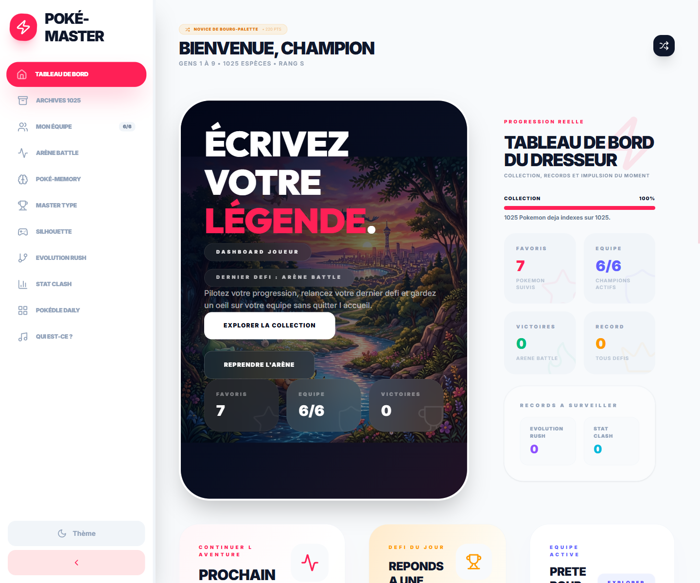
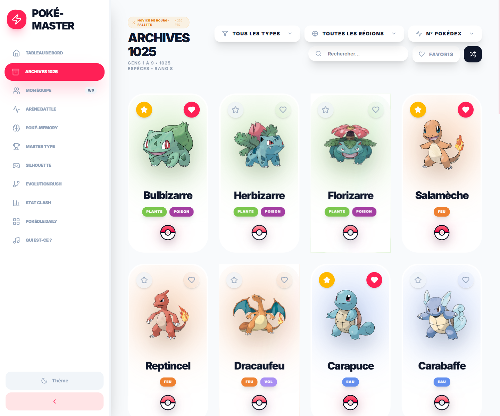
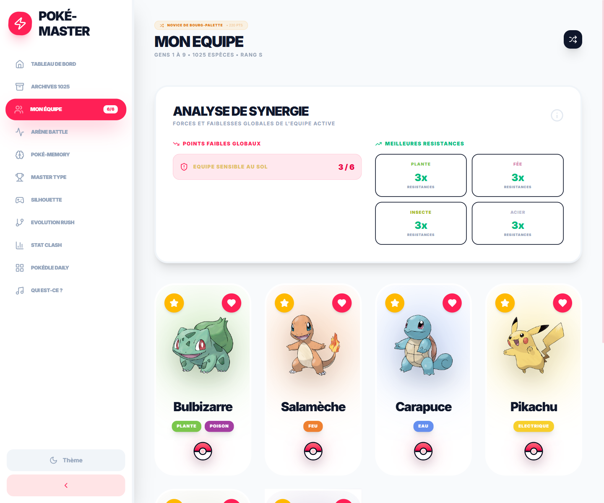
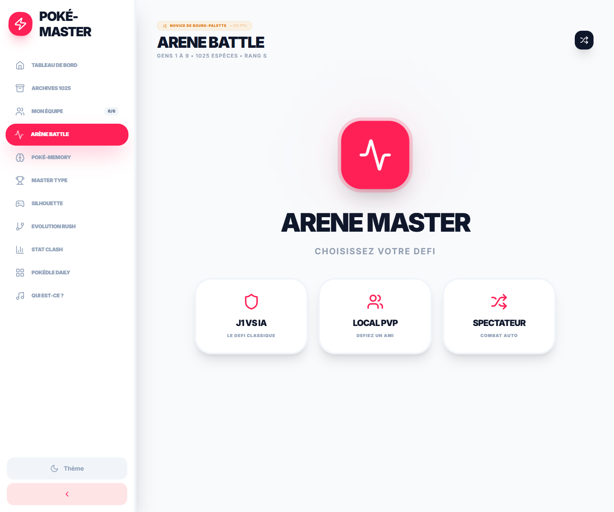
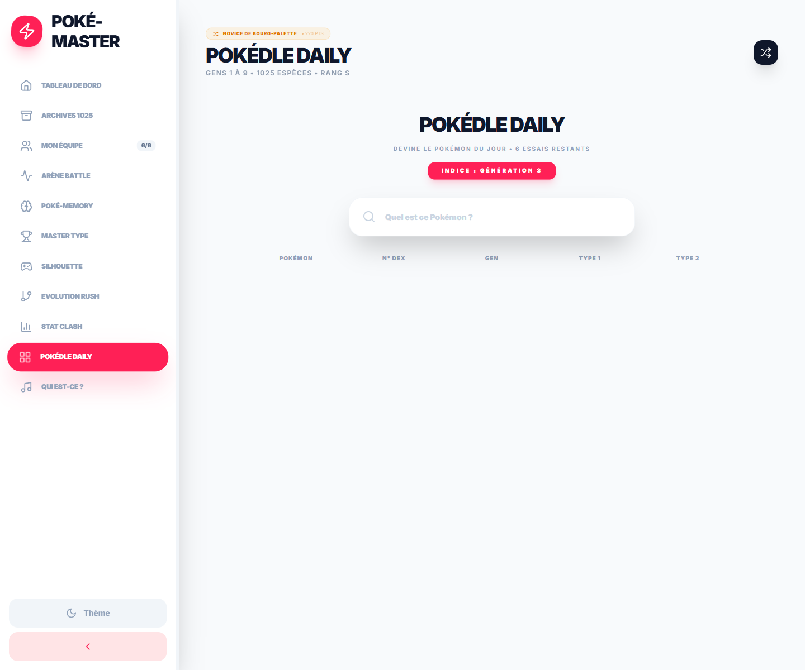

# Poké-Master

Poké-Master est un Pokédex moderne construit avec React et Vite. L'application combine une collection locale de 1025 Pokémon, un tableau de bord de progression, la gestion d'équipe, des favoris et plusieurs mini-jeux autour de l'univers Pokémon.

## Aperçu

- Tableau de bord avec progression, défi du jour, statistiques et historique d'activité
- Collection de 1025 Pokémon avec recherche, tri, filtres par type et génération
- Fiches détaillées avec navigation, comparaison et ajout aux favoris
- Gestion d'équipe jusqu'à 6 Pokémon avec analyse de synergie
- Arène de combat avec plusieurs modes
- Mini-jeux inclus :
  - `Master Type`
  - `Silhouette`
  - `Poké-Memory`
  - `Evolution Rush`
  - `Stat Clash`
  - `Pokédle Daily`
  - `Cry Quiz`

## Captures d'écran

### Tableau de bord



### Collection



### Équipe et synergie



### Arène de combat



### Pokédle Daily



## Stack technique

- React 19
- Vite 6
- Tailwind CSS 4
- Framer Motion
- Lucide React
- Vitest + Testing Library

## Lancement du projet

```bash
npm install
npm run dev
```

Vite démarre ensuite l'application en local, en général sur `http://localhost:5173`.

## Scripts disponibles

```bash
npm run dev
npm run build
npm run preview
npm run lint
npm run test
npm run test:watch
```

## Données et fonctionnement

- Les données du Pokédex sont chargées depuis `public/pokedex.json`
- L'état utilisateur est conservé dans le `localStorage` :
  - équipe
  - favoris
  - thème
  - activité quotidienne
  - dernier onglet joué
- Les cris Pokémon utilisés dans le quiz audio proviennent de PokeAPI

## Arborescence utile

- `src/App.jsx` : orchestration générale de l'application
- `src/components/` : pages, layout, modales, cartes et mini-jeux
- `src/hooks/` : logique métier, persistance locale et gestion des jeux
- `src/constants/` : métadonnées des modes, types et générations
- `src/test/` : tests Vitest et Testing Library
- `public/pokedex.json` : dataset local des 1025 Pokémon
- `screenshots/` : captures utilisées dans la documentation

## Vérification

Le `README` a été remis à jour en fonction de l'état actuel du projet et des écrans générés depuis l'application locale le 22 avril 2026.
